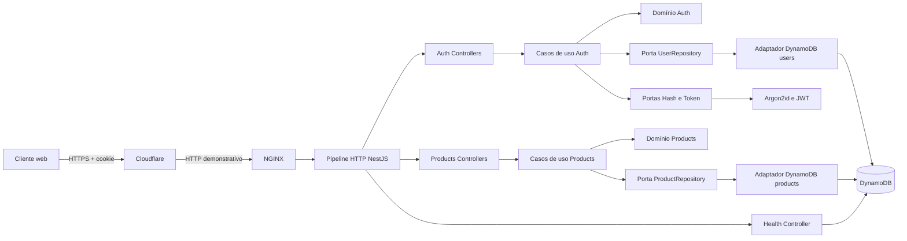

# Design Técnico — API de cadastro, autenticação e catálogo de produtos

| Status       | Aprovado   |
|--------------|------------|
| Created      | 2026-09-03 |
| Last Updated | 2026-09-03 |

PRD de referência: [PRODUCT-REQUIREMENTS.md](./PRODUCT-REQUIREMENTS.md) (`Aprovado`)

## Histórico de atualizações

| Data       | Alteração |
|------------|-----------|
| 2026-09-03 | Versão inicial consolidada a partir do PRD aprovado, das ADRs e dos contratos existentes. |
| 2026-09-03 | Design encaminhado para revisão após definição de HS256 e capacidade sob demanda. |
| 2026-09-03 | Design técnico aprovado pelo solicitante. |
| 2026-09-04 | Revisão material aprovada: `DEC-05` fica histórica e a proteção passa a usar `SameSite=Strict` com `Origin`/`Referer`. |

## Contexto técnico e estado atual

O repositório contém o PRD aprovado e documentação técnica aceita, mas ainda não possui implementação da aplicação. Portanto, não há código, banco ou componente executável a reutilizar; serão reutilizadas as decisões documentais como fonte arquitetural, sem tratá-las como evidência de funcionalidade entregue.

As referências existentes definem:

- separação por domínio e camadas de Clean Architecture na [ADR-001](../../docs/adr/ADR-001-clean-architecture-backend.md);
- cadastro independente do login, unicidade de e-mail e hash de senha na [ADR-002](../../docs/adr/ADR-002-cadastro-de-usuarios.md);
- duas tabelas, padrões de acesso e cursor alinhado ao DynamoDB na [ADR-003](../../docs/adr/ADR-003-modelagem-dynamodb.md);
- rate limit Fixed Window por IP efetivo e operação na [ADR-004](../../docs/adr/ADR-004-rate-limit.md);
- consumo direto da API, JWT em cookie HttpOnly e decisões de cookie na [ADR-005](../../docs/adr/ADR-005-autenticacao-cookie-http-only.md);
- proteção CSRF por cookie e validação de origem na [ADR-006](../../docs/adr/ADR-006-protecao-csrf-origem.md);
- endpoints e esquemas públicos no [Contrato da API](../../docs/Contrato-da-API.md);
- tecnologias adotadas em [Decisões de tecnologia](../../docs/Decisao-tecnologias.md);
- topologia, segurança operacional, CI/CD e rollback na [Decisão de deploy](../../docs/Decisao-deploy.md).

Limitações conhecidas: a listagem inicial usa `Scan`, o rate limit reside na memória de uma única instância, o logout não revoga antecipadamente cópias do JWT, não há controle de concorrência otimista nos produtos e o trecho Cloudflare–VPS permanece sem TLS na demonstração.

## Objetivos técnicos e limites da solução

- Estruturar uma API modular, testável e independente de detalhes de framework ou persistência nas regras de negócio.
- Expor os contratos REST aprovados com validação centralizada, autenticação por cookie e erros consistentes.
- Garantir unicidade de usuário e existência de produto de forma atômica no DynamoDB.
- Isolar a representação do DynamoDB, o hash de senha, a emissão de JWT e o transporte HTTP atrás de fronteiras explícitas.
- Proteger todos os endpoints com rate limit e todas as mutações com `SameSite=Strict` e validação de origem conforme as políticas aprovadas.
- Entregar documentação OpenAPI, readiness, logs correlacionáveis e testes nos níveis unitário, integração e E2E.
- Produzir uma imagem reproduzível e publicá-la na topologia demonstrativa já decidida.

A solução não cria BFF, sessão persistida, refresh token, autorização por papéis, propriedade individual de produtos, eventos assíncronos, cache, pesquisa, ordenação global ou paginação por deslocamento.

## Escopo técnico, exclusões e evoluções futuras

### Dentro do escopo técnico

- Aplicação NestJS em TypeScript estrito, organizada por `auth`, `products` e componentes transversais mínimos.
- Casos de uso para cadastro, autenticação e CRUD paginado de produtos.
- Adaptadores de DynamoDB, Argon2id, JWT, relógio e geração de identificadores.
- Pipeline HTTP para correlação, CORS, rate limit, validação de origem, autenticação, validação e mapeamento de erros.
- OpenAPI, endpoint de readiness e observabilidade operacional.
- DynamoDB Local e recursos isolados de teste.
- Container, proxy reverso, infraestrutura AWS, CI/CD, publicação e rollback.

### Exclusões

- Componentes de pedidos — não pertencem ao domínio aprovado.
- Interface web ou endpoints `/api/*` do Next.js — o cliente chama a API diretamente conforme a [ADR-005](../../docs/adr/ADR-005-autenticacao-cookie-http-only.md).
- Upload de imagem — `imageUrl` é somente uma referência textual.
- Sessão server-side, refresh token ou revogação — excluídos pela [ADR-005](../../docs/adr/ADR-005-autenticacao-cookie-http-only.md).
- Redis ou contador distribuído — a versão inicial é de instância única conforme a [ADR-004](../../docs/adr/ADR-004-rate-limit.md).
- GSI, sort key ou Single Table Design — não há padrão de acesso que os justifique segundo a [ADR-003](../../docs/adr/ADR-003-modelagem-dynamodb.md).
- Endpoint HTTP de liveness — o estado do processo ou container cumpre essa função.
- Migração de dados — não existe base legada.

### Evoluções futuras

- Substituir `Scan` por `Query` mediante remodelagem ou GSI quando volume, ordenação ou filtros exigirem.
- Mover contadores de rate limit para armazenamento compartilhado antes de executar uma segunda instância.
- Adotar rotação de chaves, refresh token ou revogação somente após nova decisão de autenticação.
- Acrescentar TLS na origem e, se necessário, migrar a imagem para ECS Fargate com IAM Role, balanceamento e observabilidade gerenciada.
- Introduzir controle de concorrência otimista se edições simultâneas se tornarem um caso de uso relevante.

## Arquitetura e componentes

A solução será um monólito modular. Os módulos de negócio se comunicam apenas por casos de uso e portas; não acessam adaptadores concretos uns dos outros. A regra de dependência da [ADR-001](../../docs/adr/ADR-001-clean-architecture-backend.md) é: apresentação e infraestrutura dependem da aplicação; aplicação depende do domínio; domínio não depende de NestJS, HTTP, AWS SDK ou JWT.

- **Borda Cloudflare e NGINX** — termina o acesso público, encaminha requisições à única instância, reconstrói cabeçalhos de proxy confiáveis e aplica controles operacionais. Não autentica usuários nem executa regras de domínio.
- **Bootstrap e composition root** — valida a configuração, conecta implementações às portas, habilita o pipeline HTTP e inicializa os módulos. Não contém regra de negócio.
- **Pipeline HTTP transversal** — atribui `correlationId`, trata CORS/preflight, identifica o IP efetivo, aplica rate limit, valida `Origin`/`Referer` em métodos não seguros, autentica o cookie, valida DTOs e converte erros. `GET`, `HEAD` e `OPTIONS` não passam pela verificação de origem; preflight termina antes do rate limiter; demais requisições passam pelo rate limiter antes de autenticação, validação de payload ou acesso ao banco, conforme a [ADR-004](../../docs/adr/ADR-004-rate-limit.md).
- **Módulo Auth — domínio** — representa usuário, e-mail normalizado e invariantes que não dependem do transporte.
- **Módulo Auth — aplicação** — coordena `RegisterUser` e `AuthenticateUser` por portas de repositório, hash, token, relógio e identificador. Logout apenas expira o cookie e não cria estado de sessão, conforme a [ADR-005](../../docs/adr/ADR-005-autenticacao-cookie-http-only.md).
- **Módulo Auth — infraestrutura** — implementa persistência de usuários, Argon2id e assinatura/verificação de JWT.
- **Módulo Auth — apresentação** — expõe cadastro, login e logout, serializa somente dados públicos e controla o cookie.
- **Módulo Products — domínio** — representa produto e suas invariantes de nome, descrição, preço e URL.
- **Módulo Products — aplicação** — coordena `CreateProduct`, `ListProducts`, `GetProduct`, `UpdateProduct` e `DeleteProduct` por uma porta específica de produtos.
- **Módulo Products — infraestrutura** — mapeia domínio para DynamoDB, executa escritas condicionais, isola `LastEvaluatedKey` e codifica o cursor.
- **Módulo Products — apresentação** — expõe os cinco contratos REST protegidos e converte entrada e saída sem regras de persistência.
- **Módulo Health** — verifica inicialização e acesso às duas tabelas necessárias sem expor detalhes da dependência.
- **OpenAPI** — descreve DTOs, cookies, cabeçalhos, respostas e erros a partir dos contratos de apresentação; será servido em interface navegável e em JSON.
- **Infraestrutura de entrega** — provisiona tabelas e IAM, produz imagem imutável, publica no GHCR, atualiza a VPS e verifica readiness.



Toda comunicação de negócio é síncrona por chamada em processo; a comunicação externa usa HTTP/JSON e AWS SDK sobre TLS. Não há eventos ou mensageria nesta versão.

## Tecnologias e responsabilidades

Como o código ainda não existe, “introduzida” indica implementação nova; a decisão correspondente já existe na documentação quando houver referência.

| Tecnologia ou mecanismo | Responsabilidade que atende | Já existe ou será introduzida | Requisito ou restrição que influencia | Dependências ou riscos que cria |
|------------------------|-----------------------------|--------------------------------|-------------------------------------|---------------------------------|
| Node.js LTS | Runtime suportado para a API | Introduzido; exigido em [Decisões de tecnologia](../../docs/Decisao-tecnologias.md) | Restrição de runtime; `EXPECT-08` | Compatibilidade entre versão LTS e NestJS. |
| TypeScript estrito | Tipagem dos contratos, portas e domínio | Introduzido; exigido em [Decisões de tecnologia](../../docs/Decisao-tecnologias.md) | Restrição de linguagem; `EXPECT-08` | Exige tipos explícitos nas fronteiras externas. |
| NestJS | Composition root, módulos, controllers, guards e DI | Introduzido; definido na [ADR-001](../../docs/adr/ADR-001-clean-architecture-backend.md) | `AAP-01`–`AAP-60` | Risco de acoplar domínio ao framework, mitigado pelas camadas. |
| REST com JSON | Contrato síncrono entre cliente e API | Introduzido; definido no [Contrato da API](../../docs/Contrato-da-API.md) | `AAP-01`–`AAP-60` | Mudanças incompatíveis exigem coordenação com clientes. |
| Validação e transformação de DTOs | Rejeição, normalização e whitelist das entradas | Introduzida; definida em [Decisões de tecnologia](../../docs/Decisao-tecnologias.md) | `AAP-02`–`AAP-07`, `AAP-26`–`AAP-29`, `AAP-34`, `AAP-37`, `AAP-41`–`AAP-44`, `AAP-51`, `AAP-52` | Validação apenas na apresentação não substitui invariantes do domínio. |
| DynamoDB | Persistência de usuários e produtos | Introduzido; definido na [ADR-003](../../docs/adr/ADR-003-modelagem-dynamodb.md) | `AAP-01`–`AAP-09`, `AAP-25`–`AAP-49`, `AAP-58`, `AAP-59` | `Scan` cresce em custo; consistência e condicionais devem ser explícitas. |
| Capacidade sob demanda | Eliminar dimensionamento de capacidade na demonstração | Introduzida; decisão aprovada neste design | Restrição de baixo volume e simplicidade operacional | Custo varia com uso; orçamento e métricas continuam necessários. |
| AWS SDK v3 Document Client | Adaptar os padrões de acesso do DynamoDB | Introduzido; definido em [Decisões de tecnologia](../../docs/Decisao-tecnologias.md) | `AAP-07`, `AAP-25`, `AAP-31`–`AAP-49` | Erros condicionais e tipos precisam de mapeamento estável. |
| Argon2id | Hash adaptativo de senhas | Introduzido; definido na [ADR-002](../../docs/adr/ADR-002-cadastro-de-usuarios.md) | `EXPECT-01`, `EXPECT-02` | Consome CPU e memória; parâmetros precisam ser calibrados e testados. |
| JWT com HS256 | Credencial stateless com emissor, audiência e expiração verificáveis | Introduzido; transporte definido na [ADR-005](../../docs/adr/ADR-005-autenticacao-cookie-http-only.md), algoritmo aprovado neste design | `AAP-09`–`AAP-19`, `EXPECT-03`, `EXPECT-05` | Todas as instâncias validadoras precisariam compartilhar o segredo; rotação não está coberta. |
| Cookie HttpOnly host-only | Transportar JWT sem expô-lo ao JavaScript | Introduzido; definido na [ADR-005](../../docs/adr/ADR-005-autenticacao-cookie-http-only.md) | `AAP-11`–`AAP-19`, `EXPECT-03` | Exige HTTPS publicado, configuração consistente e mitigação de CSRF. |
| CORS exato + `SameSite=Strict` + validação de origem | Restringir clientes web credenciados e bloquear mutações forjadas | Introduzido; definido na [ADR-006](../../docs/adr/ADR-006-protecao-csrf-origem.md) | `AAP-20`–`AAP-24`, `AAP-60` | Uma origem permissiva ou subdomínio não controlado invalida a proteção; headers ausentes deixam um risco residual aceito. |
| Fixed Window em memória | Limitar abuso por IP, método e template de rota | Introduzido; definido na [ADR-004](../../docs/adr/ADR-004-rate-limit.md) | `AAP-23`, `AAP-24`, `AAP-53`–`AAP-55` | Reinício limpa contadores; múltiplas instâncias tornam o limite não global. |
| OpenAPI | Fonte operacional dos contratos | Introduzido; definido em [Decisões de tecnologia](../../docs/Decisao-tecnologias.md) | `AAP-56`, `AAP-57`, `EXPECT-06` | DTOs e respostas precisam permanecer alinhados ao comportamento real. |
| Jest, Supertest e DynamoDB Local | Testes unitários, de integração e E2E isolados | Introduzidos; definidos na [ADR-001](../../docs/adr/ADR-001-clean-architecture-backend.md) | `EXPECT-07`, `EXPECT-08` | Ambiente local deve reproduzir condicionais e paginação relevantes. |
| Docker e Docker Compose | Ambiente reproduzível e empacotamento da API | Introduzidos; definidos em [Decisões de tecnologia](../../docs/Decisao-tecnologias.md) | `EXPECT-08`–`EXPECT-10` | Imagem deve excluir segredos e executar sem privilégios. |
| Terraform | Provisionamento das tabelas e IAM publicados | Introduzido; definido na [Decisão de deploy](../../docs/Decisao-deploy.md) | Restrições de persistência e menor privilégio | Estado remoto e credenciais administrativas precisam de proteção operacional. |
| GitHub Actions e GHCR | Validação, imagem imutável e implantação por SHA | Introduzidos; definidos na [Decisão de deploy](../../docs/Decisao-deploy.md) | `EXPECT-08`–`EXPECT-10` | Depende de secrets, disponibilidade externa e acesso SSH à VPS. |
| Cloudflare e NGINX | Borda HTTPS, proxy confiável e exposição controlada | Introduzidos; definidos na [Decisão de deploy](../../docs/Decisao-deploy.md) | `AAP-20`–`AAP-24`, `AAP-53`–`AAP-55`, `EXPECT-03` | Configuração incorreta de proxy permite falsificação de IP; origem HTTP não é confidencial. |

Alternativas e justificativas estão consolidadas em [Decisões, alternativas e trade-offs](#decisões-alternativas-e-trade-offs); decisões reaproveitadas preservam a referência à ADR correspondente.

## Fluxo de dados e integrações

1. **Cadastro** — navegador → pipeline HTTP → `RegisterUser` → hash Argon2id → escrita condicional em `users` → resposta pública (`HTTPS/REST`, síncrono).
2. **Login** — navegador → pipeline HTTP → `AuthenticateUser` → leitura de `users` pelo e-mail normalizado → verificação Argon2id → JWT HS256 → `Set-Cookie` (`HTTPS/REST`, síncrono).
3. **Logout** — navegador → pipeline HTTP → expiração do cookie com os mesmos atributos de escopo; nenhuma leitura ou escrita de sessão ocorre (`HTTPS/REST`, síncrono).
4. **Requisição de produto** — cliente → CORS/rate limit → validação de `Origin`/`Referer` quando aplicável → JWT do cookie → controller → caso de uso → porta de produto → DynamoDB (`HTTPS/REST` e AWS SDK, síncrono).
5. **Listagem** — `ListProducts` solicita `Scan` com `Limit` e chave inicial → adaptador recebe `LastEvaluatedKey` → codifica cursor versionado em Base64 URL-safe → resposta entrega `items` e `nextCursor` quando aplicável.
6. **Atualização** — `UpdateProduct` valida o patch no domínio → adaptador monta somente atributos enviados → `UpdateItem` condicional à existência → retorna o produto atualizado.
7. **Exclusão** — `DeleteProduct` executa `DeleteItem` condicional à existência → ausência mapeia para `PRODUCT_NOT_FOUND` → sucesso retorna sem corpo.
8. **Readiness** — monitor ou pipeline → `/health` → verificação das tabelas `users` e `products` → `200` ou erro opaco `503`.
9. **Entrega** — merge na branch principal → GitHub Actions valida → constrói imagem → publica SHA no GHCR → atualiza Compose na VPS → confirma `/health` público.

### Integrações externas

- **Cliente web:** envia `credentials: include` e uma origem autorizada nas mutações; armazena cursores sem interpretá-los. Swagger, CLI e back-ends que usam cookie podem omitir `Origin` e `Referer`.
- **DynamoDB:** fornece persistência e condicionais. Falhas de domínio condicionais são mapeadas para conflito ou não encontrado; indisponibilidade não expõe detalhes internos.
- **Cloudflare/NGINX:** preservam somente a cadeia confiável de IP. O NGINX descarta cabeçalhos de encaminhamento não confiáveis recebidos do cliente.
- **GHCR/GitHub Actions/VPS:** entregam imagens identificadas por SHA. Falha na verificação de readiness interrompe a conclusão do deploy e permite reapontar para a imagem anterior.
- **Monitor externo:** consulta apenas readiness; liveness continua responsabilidade do runtime do container.

Não existem integrações assíncronas, callbacks ou eventos nesta versão.

## Contratos de API, eventos ou interfaces

O [Contrato da API](../../docs/Contrato-da-API.md) e o OpenAPI gerado são as fontes operacionais. O design preserva os endpoints sem prefixo ou versão adicional.

| Contrato | Consumidor | Forma | Esquema resumido |
|----------|------------|-------|------------------|
| `POST /auth/register` | Visitante e cliente web | REST público + origem | Entrada `{ name: string, email: string, password: string }`; `201` com `{ id, name, email }`. |
| `POST /auth/login` | Pessoa cadastrada | REST público + origem | Entrada `{ email, password }`; `204` com `Set-Cookie`; sem corpo. |
| `POST /auth/logout` | Cliente web | REST + origem; cookie opcional | `204` com cookie expirado; operação idempotente. |
| `GET /products` | Pessoa autenticada | REST + cookie | Query `limit?: integer` e `cursor?: string`; `200` com `{ items: Product[], nextCursor?: string }`. |
| `POST /products` | Pessoa autenticada | REST + cookie + origem | Entrada `{ name, description, price, imageUrl }`; `201` com `Product`. |
| `GET /products/:id` | Pessoa autenticada | REST + cookie | `200` com `Product`; `404` quando ausente. |
| `PATCH /products/:id` | Pessoa autenticada | REST + cookie + origem | Subconjunto não vazio de campos editáveis; `200` com `Product`. |
| `DELETE /products/:id` | Pessoa autenticada | REST + cookie + origem | `204` sem corpo; `Content-Type` não é exigido sem corpo. |
| `GET /health` | Pipeline, monitor e operador | REST público | `200 { status: "ok" }`; `503` no erro padrão quando não pronto. |
| `/docs` | Desenvolvedor e avaliador | OpenAPI UI | Interface navegável com autenticação por cookie. |
| `/docs-json` | Ferramentas e avaliador | OpenAPI JSON | Documento OpenAPI exportável. |

### Produto público

```text
Product = {
  id: string,
  name: string,
  description: string,
  price: number,
  imageUrl: string,
  createdAt: string ISO 8601,
  updatedAt: string ISO 8601
}
```

### Erro público

```text
ApiError = {
  statusCode: number,
  code: string,
  message: string,
  correlationId: string,
  errors?: Array<{ field: string, code: string, message: string }>
}
```

`errors` aparece somente em validação. Valores recebidos, stack traces, nomes de tabela, respostas do DynamoDB, hashes e tokens não atravessam essa fronteira.

### JWT e cookie

- JWT assinado com `HS256`; a validação aceita somente esse algoritmo.
- Claims: `sub` com o identificador opaco do usuário, `iss`, `aud`, `iat` e `exp`; nome, e-mail e permissões não entram no token.
- `exp - iat = 900` segundos; emissor, audiência e segredo são configuração obrigatória.
- O segredo terá entropia mínima de 256 bits e nunca terá valor padrão no ambiente publicado.
- Cookie publicado: `__Host-stone_access_token`, `HttpOnly`, `Secure`, `SameSite=Strict`, `Path=/`, sem `Domain`, `Max-Age=900`.
- Desenvolvimento HTTP usa nome distinto sem prefixo `__Host-`; essa configuração não pode ser usada no ambiente publicado.

### CORS e CSRF

- Origens credenciadas são comparadas por correspondência exata com configuração explícita.
- Métodos permitidos: `GET`, `POST`, `PATCH`, `DELETE` e `OPTIONS`.
- Cabeçalhos de requisição permitidos: `Content-Type`.
- Cabeçalho exposto: `Retry-After`.
- `GET`, `HEAD` e `OPTIONS` não passam pela verificação de origem.
- Nos demais métodos, `Origin` presente deve ser HTTP(S), bem formado e corresponder exatamente à origem da API ou a uma origem permitida.
- Somente quando `Origin` estiver ausente, `Referer` é interpretado; sua origem deve ser autorizada. `Origin` inválido nunca usa `Referer` como compensação.
- Com ambos ausentes, a chamada é aceita e segue para autenticação, validação e caso de uso.
- `OPTIONS` termina antes de autenticação e rate limit de negócio.

Não há contrato de eventos nesta versão porque todos os fluxos são síncronos.

## Modelo e alterações de dados

### Tabela `users`

| Atributo | Tipo | Regra |
|----------|------|-------|
| `email` | String, chave de partição | Valor sem espaços nas extremidades e em minúsculas; unicidade por `attribute_not_exists(email)`. |
| `id` | String | Identificador imutável, opaco e gerado com fonte criptograficamente segura; usado em `sub`. |
| `name` | String | Nome normalizado com 2 a 100 caracteres. |
| `passwordHash` | String | Hash Argon2id com parâmetros incorporados ao formato armazenado. |
| `createdAt` | String ISO 8601 UTC | Instante de criação fornecido por porta de relógio. |

Padrões de acesso: `GetItem` por e-mail no login e `PutItem` condicional no cadastro. A modelagem reaproveita a [ADR-002](../../docs/adr/ADR-002-cadastro-de-usuarios.md) e a [ADR-003](../../docs/adr/ADR-003-modelagem-dynamodb.md).

### Tabela `products`

| Atributo | Tipo | Regra |
|----------|------|-------|
| `id` | String, chave de partição | Identificador único, opaco e gerado com fonte criptograficamente segura. |
| `name` | String | 2 a 100 caracteres. |
| `description` | String | 1 a 500 caracteres. |
| `price` | Number | Maior que zero e validado com até duas casas decimais. |
| `imageUrl` | String | URL HTTP(S) de até 2.048 caracteres; nenhum arquivo é armazenado. |
| `createdAt` | String ISO 8601 UTC | Instante imutável de criação. |
| `updatedAt` | String ISO 8601 UTC | Instante da última criação ou alteração. |

Padrões de acesso, todos definidos na [ADR-003](../../docs/adr/ADR-003-modelagem-dynamodb.md):

- `PutItem` condicional para criar;
- `Scan` com `Limit` e `ExclusiveStartKey` para listar;
- `GetItem` por `id` para consultar;
- `UpdateItem` dinâmico e condicional para atualizar somente campos enviados;
- `DeleteItem` condicional para excluir.

As duas tabelas usam capacidade sob demanda, chave de partição simples, sem sort key e sem índice secundário. O adaptador converte itens persistidos em entidades; formatos do DynamoDB não entram no domínio.

### Cursor

O cursor é um envelope interno versionado, serializado em JSON e codificado em Base64 URL-safe. Ele contém somente a versão e a chave de continuação devolvida pelo DynamoDB. A decodificação valida versão, estrutura, tipos e tamanho antes de produzir `ExclusiveStartKey`; qualquer falha gera `VALIDATION_ERROR` sem detalhes internos.

Base64 é apenas codificação, não criptografia. O cursor não contém senha, token ou dado pessoal, e a manipulação não amplia acesso porque todo catálogo é compartilhado e a rota continua autenticada. Por isso, assinatura ou criptografia do cursor não será introduzida nesta versão.

### Alterações e migração

Não há dados existentes a alterar. O provisionamento cria as duas tabelas de forma idempotente no ambiente local e por Terraform no ambiente publicado. Mudanças futuras de esquema ou índice exigirão estratégia de migração separada.

## Segurança, privacidade e observabilidade

### Segurança

- No ambiente publicado, credenciais são aceitas somente no corpo de requisições HTTPS e nunca são registradas.
- A senha é transformada por Argon2id antes de qualquer persistência; a string em texto puro não sai do fluxo da requisição.
- JWT usa `HS256` com segredo de no mínimo 256 bits e valida algoritmo, assinatura, emissor, audiência e expiração.
- Produtos exigem guard JWT; métodos não seguros validam `Origin` ou `Referer` antes do caso de uso conforme a [ADR-006](../../docs/adr/ADR-006-protecao-csrf-origem.md).
- DTOs rejeitam propriedades desconhecidas; o domínio repete invariantes essenciais para não depender da apresentação.
- Escritas condicionais garantem unicidade e existência sem janela de corrida.
- Segredos residem apenas em GitHub Secrets e no ambiente protegido da VPS; a imagem e o repositório não os contêm.
- IAM de execução limita ações às tabelas `users` e `products`; provisionamento usa identidade administrativa separada.
- O NGINX remove cabeçalhos de proxy fornecidos diretamente pelo cliente e aceita como autoridade somente a cadeia confiável.

### Privacidade

Dados pessoais tratados: nome, e-mail e hash de senha. Não há confirmação de e-mail, perfil comportamental ou armazenamento do IP especificamente para rate limit. Logs não contêm e-mail por padrão; investigação que exija dado pessoal deverá ser uma decisão operacional separada. O cursor contém apenas chave técnica de produto.

Não existe requisito de exclusão de conta ou prazo de retenção no PRD; por isso, políticas adicionais de ciclo de vida de usuário são não aplicáveis nesta versão.

### Observabilidade

- Cada requisição recebe `correlationId` opaco gerado pela API antes dos componentes que podem falhar.
- Logs estruturados incluem horário, nível, `correlationId`, método, template da rota, status e duração.
- Erros registram categoria técnica sanitizada, nunca senha, hash, JWT, cookie, credencial AWS, corpo sensível ou stack trace em resposta.
- Respostas `429` produzem métrica agregada por template de endpoint; o IP bruto não é registrado especificamente pelo rate limiter.
- O ambiente acompanha readiness, reinícios do container e métricas do DynamoDB, especialmente consumo e throttling.
- Alertas de cobrança e orçamento protegem a demonstração contra uso inesperado.

## Desempenho, disponibilidade e resiliência

### Desempenho

O PRD não define meta de latência ou throughput. O limite de página entre 1 e 100 reduz o tamanho de cada leitura, mas `Scan` consome capacidade proporcional ao que percorre e não é adequado a alto volume. Métricas de consumo e throttling indicarão quando revisar a [ADR-003](../../docs/adr/ADR-003-modelagem-dynamodb.md).

### Disponibilidade

A demonstração possui uma API, uma VPS e uma região do DynamoDB; não há SLA, redundância de origem, multi-região ou deploy sem interrupção. `/health` retorna `200` somente após inicialização e acesso às duas tabelas, e retorna `503` sanitizado quando uma dependência necessária falhar.

### Resiliência

- Cadastro, criação, atualização e exclusão usam condicionais para evitar resultados incorretos sob concorrência.
- O logout é idempotente e não depende de DynamoDB.
- A API não repete automaticamente uma operação HTTP mutável iniciada pelo cliente.
- Retentativas transitórias do adaptador devem preservar o identificador e a operação lógica da requisição; não transformam uma única execução em dois recursos.
- Falhas inesperadas do DynamoDB são mapeadas para `INTERNAL_ERROR`; somente readiness usa `SERVICE_UNAVAILABLE`.
- Reinício da API perde buckets de rate limit, mas não invalida JWTs nem dados persistidos.
- Atualizações simultâneas do mesmo produto seguem last-write-wins; controle de versão fica adiado por ausência de requisito.
- Rollback reaponta o Compose para o SHA anterior e só conclui após validar `/health`.

## Decisões, alternativas e trade-offs

| ID | Decisão | Alternativas consideradas | Motivo da escolha | Trade-offs aceitos |
|----|---------|---------------------------|-------------------|--------------------|
| `DEC-01` | Monólito modular com Clean Architecture por domínio, conforme a [ADR-001](../../docs/adr/ADR-001-clean-architecture-backend.md). | Estrutura NestJS por tipo; repositório genérico; microsserviços. | Isola domínio, facilita testes e mantém complexidade proporcional ao desafio. | Mais portas, mapeadores e arquivos. |
| `DEC-02` | Cliente web consome a API REST diretamente, sem BFF, conforme a [ADR-005](../../docs/adr/ADR-005-autenticacao-cookie-http-only.md). | Route Handlers/BFF; API GraphQL. | Mantém a API como única autoridade e evita duplicar contratos. | A API assume CORS, cookies e validação de origem. |
| `DEC-03` | JWT stateless em cookie HttpOnly host-only, conforme a [ADR-005](../../docs/adr/ADR-005-autenticacao-cookie-http-only.md). | `localStorage`; sessão opaca; cookie e Bearer simultâneos. | Reduz exposição ao JavaScript e mantém um único fluxo. | Logout não revoga cópia do token; a proteção CSRF depende de `SameSite` e origem. |
| `DEC-04` | Assinatura JWT `HS256`, segredo mínimo de 256 bits, claims mínimas e validação explícita de algoritmo, emissor, audiência e expiração. | `RS256`/`ES256`; algoritmo inferido da mensagem. | A mesma API emite e valida; chave assimétrica não traz separação útil nesta versão. | Futuras validações por terceiros exigirão migração e rotação coordenada. |
| `DEC-05` | CORS por origem exata mais cabeçalho CSRF obrigatório, conforme a [ADR-005](../../docs/adr/ADR-005-autenticacao-cookie-http-only.md). **Decisão histórica substituída pela `DEC-20`.** | Token CSRF server-side; `SameSite` como única defesa; origens curinga. | Registro da decisão anterior e de seus trade-offs. | Não é a estratégia ativa; consultar a `DEC-20`. |
| `DEC-06` | Duas tabelas DynamoDB independentes, conforme a [ADR-003](../../docs/adr/ADR-003-modelagem-dynamodb.md). | Single Table Design; banco relacional. | Espelha os dois padrões de acesso sem modelagem antecipada. | Consultas novas podem exigir índice ou migração. |
| `DEC-07` | Capacidade DynamoDB sob demanda (`PAY_PER_REQUEST`). | Capacidade provisionada; provisionada com Auto Scaling. | Evita previsão de capacidade em uma demonstração de baixo volume. | Custo acompanha uso e não há teto rígido sem controles externos. |
| `DEC-08` | Listagem por `Scan` e cursor derivado de `LastEvaluatedKey`, conforme a [ADR-003](../../docs/adr/ADR-003-modelagem-dynamodb.md). | `Query` com partição fixa/GSI; `OFFSET`; carregar tudo. | É o padrão mais simples para catálogo global pequeno e respeita a paginação nativa. | Não escala bem, não ordena globalmente e só navega sequencialmente. |
| `DEC-09` | Cursor versionado em Base64 URL-safe, validado e não assinado. | Base64 simples; cursor assinado; cursor criptografado. | Mantém contrato URL-safe e evolutivo; o conteúdo não é sensível nem concede acesso. | Cliente pode decodificar ou adulterar, embora continue sem garantia semântica e receba validação segura. |
| `DEC-10` | Escritas condicionais garantem unicidade e existência, conforme as [ADR-002](../../docs/adr/ADR-002-cadastro-de-usuarios.md) e [ADR-003](../../docs/adr/ADR-003-modelagem-dynamodb.md). | Consultar antes de escrever; transações para cada operação. | Remove janelas de corrida com uma operação atômica. | Exige mapear corretamente falhas condicionais. |
| `DEC-11` | Senhas usam Argon2id, conforme a [ADR-002](../../docs/adr/ADR-002-cadastro-de-usuarios.md). | bcrypt; scrypt; hash rápido. | Algoritmo adaptativo e resistente a ataques com hardware paralelo. | Maior consumo de CPU/memória e necessidade de calibração. |
| `DEC-12` | Rate limit Fixed Window em memória por IP efetivo, método e template, conforme a [ADR-004](../../docs/adr/ADR-004-rate-limit.md). | Sliding Window; Token Bucket; Redis; chave por usuário. | Política simples, determinística e auditável para uma instância. | Rajadas na fronteira, falsos positivos por NAT e perda no reinício. |
| `DEC-13` | Validação HTTP, erros e OpenAPI são centralizados na apresentação. | Validação manual por controller; contratos documentados separadamente. | Evita divergência de formato e oferece fonte operacional única. | Exige disciplina para manter DTO, domínio e documentação alinhados. |
| `DEC-14` | Identificadores de usuário, produto e correlação são strings opacas geradas por fonte criptograficamente segura. | IDs incrementais; expor e-mail como ID público. | Evita enumeração sequencial e desacopla contrato da persistência. | IDs são menos legíveis e o formato concreto permanece detalhe de implementação. |
| `DEC-15` | Preço permanece número decimal no contrato e `Number` no DynamoDB, conforme a [ADR-003](../../docs/adr/ADR-003-modelagem-dynamodb.md). | Inteiro em centavos; string decimal. | Preserva o contrato aprovado e não há cálculo monetário nesta versão. | A implementação deve validar representação com duas casas e evitar aritmética de ponto flutuante. |
| `DEC-16` | Atualizações usam last-write-wins sem campo de versão. | Optimistic locking; transação; histórico de versões. | O PRD não define conflito de edição nem auditoria. | Atualizações concorrentes podem sobrescrever mudanças anteriores. |
| `DEC-17` | Readiness consulta as duas tabelas; liveness permanece no runtime, conforme o [Contrato da API](../../docs/Contrato-da-API.md) e a [Decisão de deploy](../../docs/Decisao-deploy.md). | Health superficial; endpoints separados de liveness/readiness. | Impede declarar pronta uma instância sem acesso aos dados necessários. | Readiness depende da latência e disponibilidade do DynamoDB. |
| `DEC-18` | Pirâmide de testes com domínio isolado, repositórios no DynamoDB Local e E2E HTTP, conforme a [ADR-001](../../docs/adr/ADR-001-clean-architecture-backend.md). | Somente E2E; mocks do DynamoDB em todos os níveis. | Equilibra velocidade e fidelidade para condicionais e paginação. | Ambiente de integração adiciona custo de manutenção. |
| `DEC-19` | Publicação híbrida Cloudflare → NGINX/VPS → DynamoDB e imagens por SHA, conforme a [Decisão de deploy](../../docs/Decisao-deploy.md). | Serverless AWS; ECS Fargate imediato; deploy manual. | Reaproveita a VPS e demonstra AWS/DynamoDB com rollback rastreável. | Ponto único de falha, credencial AWS duradoura e origem sem TLS. |
| `DEC-20` | Cookie `SameSite=Strict` com validação exata de `Origin` e fallback de `Referer`, conforme a [ADR-006](../../docs/adr/ADR-006-protecao-csrf-origem.md). | Header customizado; token CSRF; `Sec-Fetch-Site`; `SameSite` sozinho. | Combina defesa nativa do navegador com verificação de origem e mantém compatibilidade com clientes sem contexto de navegador. | Headers ausentes não permitem classificar o cliente; integração máquina-a-máquina própria permanece adiada. |

## Riscos, dependências e migração

| Risco | Impacto | Probabilidade | Mitigação |
|-------|---------|---------------|-----------|
| Interceptação no trecho HTTP Cloudflare–VPS | Alto | Baixa | Restringir origem à Cloudflare, evitar exposição direta e priorizar TLS ponta a ponta antes de uso real. |
| Allowlist CORS ou validação de origem permissiva | Alto | Média | Correspondência exata, parsing de `Origin`/`Referer`, configuração validada no startup e E2E de origens autorizadas e recusadas. |
| Vazamento do segredo JWT ou credenciais AWS | Alto | Baixa | Secrets fora da imagem e Git, permissões mínimas, rotação operacional e sanitização de logs. |
| `Scan` degradar com crescimento do catálogo | Médio | Média | Limite máximo de 100, métricas de consumo e gatilho explícito para GSI/remodelagem. |
| Rate limit inconsistente ao reiniciar ou escalar | Médio | Média | Manter uma instância, documentar perda de buckets e exigir armazenamento compartilhado antes da segunda. |
| Usuários legítimos compartilharem bucket por NAT | Médio | Média | Métricas agregadas por rota, investigação de picos e revisão da chave se houver falsos positivos. |
| Falsificação do IP efetivo | Alto | Média | Confiar somente na cadeia Cloudflare/NGINX, remover cabeçalhos do cliente e restringir acesso à origem. |
| Relógios divergentes afetarem JWT e janelas | Médio | Baixa | Sincronização de relógio no host e testes com relógio controlado. |
| Escritas simultâneas sobrescreverem produto | Médio | Baixa | Aceitar last-write-wins nesta versão e adotar versão condicional quando houver requisito de conflito. |
| Uso incorreto de número decimal para preço | Médio | Baixa | Validar até duas casas, não executar cálculos monetários e preservar o valor contratual no mapeamento. |
| Drift entre DTOs, OpenAPI e comportamento | Médio | Média | Gerar OpenAPI dos contratos de apresentação e validar exemplos e status em E2E. |
| Dependência da VPS, Cloudflare, GHCR, GitHub e AWS | Alto | Média | Readiness pós-deploy, imagens imutáveis, rollback por SHA e runbook documentado. |

### Dependências externas

- Conta AWS com DynamoDB, IAM e orçamento configurados.
- VPS Oracle acessível por SSH e capaz de executar Docker Compose.
- DNS/proxy Cloudflare e origem web definitiva no mesmo site registrável da API.
- GHCR e GitHub Actions com secrets de publicação e implantação.
- Segredo JWT, emissor, audiência, origens permitidas, região AWS e nomes de tabela definidos por ambiente.
- Sincronização confiável de relógio na VPS.

### Migração

Não aplicável — não há código ou dados legados. O primeiro provisionamento cria recursos idempotentes. O rollback troca apenas a imagem pelo SHA anterior e não remove tabelas; futuras mudanças de dados deverão ter migração compatível antes de usar esse mecanismo.

## Matriz de rastreabilidade com o PRD

| Requisito do PRD | Onde o design atende | Observações |
|------------------|----------------------|-------------|
| `AAP-01` | Módulo Auth; contrato de cadastro; `DEC-01` | Entrada chega ao caso de uso `RegisterUser`. |
| `AAP-02` | Domínio Auth; validação de DTO | Invariante de comprimento do nome. |
| `AAP-03` | Domínio Auth; validação de DTO; `DEC-11` | A senha só segue para hash após validação. |
| `AAP-04` | Domínio Auth; fluxo de cadastro | Normalização remove espaços nas extremidades. |
| `AAP-05` | Domínio Auth; fluxo de cadastro | Normalização converte o e-mail para minúsculas. |
| `AAP-06` | Domínio Auth; validação de DTO | Formato de e-mail validado na fronteira e no domínio. |
| `AAP-07` | Repositório de usuários; `DEC-10` | `PutItem` condicional garante unicidade atômica. |
| `AAP-08` | Apresentação Auth; contrato de cadastro | Serializer público omite hash e datas internas. |
| `AAP-09` | `RegisterUser` e `AuthenticateUser`; `DEC-03` | Cadastro não emite token nem cookie. |
| `AAP-10` | `AuthenticateUser`; repositório de usuários; `DEC-11` | Busca por e-mail normalizado e verifica Argon2id. |
| `AAP-11` | Serviço de token; `DEC-04` | `iat`, `exp` e `Max-Age` usam 900 segundos. |
| `AAP-12` | Apresentação Auth; `DEC-03` | JWT sai somente em cookie HttpOnly. |
| `AAP-13` | Contrato de login; `DEC-03` | Sucesso `204` sem corpo. |
| `AAP-14` | Mapeamento de erros Auth | Um único `INVALID_CREDENTIALS` cobre conta ou senha. |
| `AAP-15` | Apresentação Auth | Erro de credencial não chama emissor de cookie. |
| `AAP-16` | Contrato de logout; `DEC-03` | Expira cookie com escopo idêntico. |
| `AAP-17` | Contrato de logout; resiliência | Logout não consulta sessão nem exige JWT válido. |
| `AAP-18` | Guard JWT de produtos; `DEC-03` | Aplicado a todo controller de produtos. |
| `AAP-19` | Guard JWT; mapeamento de erros | Ausência, falha ou expiração mapeia para `UNAUTHORIZED`. |
| `AAP-20` | Pipeline CORS; `DEC-20` | Allowlist exata com credenciais. |
| `AAP-21` | Cookie e middleware de origem; `DEC-20` | `SameSite=Strict` e validação de origem protegem métodos não seguros. |
| `AAP-22` | Middleware de origem; `DEC-20` | `Origin` ou origem extraída de `Referer` precisa ser própria ou permitida. |
| `AAP-23` | Pipeline CORS; `DEC-20` | Preflight encerra sem autenticação. |
| `AAP-24` | Pipeline CORS/rate limit; `DEC-12` | Preflight não chega ao bucket de negócio. |
| `AAP-60` | Middleware de origem; `DEC-20` | Ausência simultânea de `Origin` e `Referer` segue para autenticação e validação. |
| `AAP-25` | `CreateProduct`; contrato de criação | Requer os quatro campos editáveis. |
| `AAP-26` | Domínio Product; validação de DTO | Nome entre 2 e 100. |
| `AAP-27` | Domínio Product; validação de DTO | Descrição entre 1 e 500. |
| `AAP-28` | Domínio Product; `DEC-15` | Preço positivo com até duas casas. |
| `AAP-29` | Domínio Product; validação de DTO | URL HTTP(S) de até 2.048. |
| `AAP-30` | Serializer Product; modelo `products` | Datas em ISO 8601 e campos públicos completos. |
| `AAP-31` | `ListProducts`; repositório de produtos | Rota protegida retorna coleção. |
| `AAP-32` | Adaptador DynamoDB; `DEC-08`, `DEC-09` | Cursor traduz `LastEvaluatedKey`. |
| `AAP-33` | DTO de listagem; `ListProducts` | Ausência de limite resulta em 20. |
| `AAP-34` | DTO de listagem; `ListProducts` | Inteiro validado no intervalo 1–100. |
| `AAP-35` | Adaptador DynamoDB; serializer de página | Chave de continuação produz `nextCursor`. |
| `AAP-36` | Serializer de página | Campo é omitido sem chave de continuação. |
| `AAP-37` | Codec de cursor; erro de validação; `DEC-09` | Falhas não expõem payload interno. |
| `AAP-38` | `GetProduct`; `GetItem` | Consulta direta por chave. |
| `AAP-39` | `UpdateProduct`; contrato de patch | Aceita subconjunto dos quatro campos. |
| `AAP-40` | `UpdateProduct`; `UpdateItem` dinâmico | Campos omitidos não entram na expressão. |
| `AAP-41` | DTO de patch | Validação exige ao menos uma propriedade. |
| `AAP-42` | DTO de patch | `null` é rejeitado. |
| `AAP-43` | Pipeline de validação | Whitelist estrita rejeita propriedade desconhecida. |
| `AAP-44` | Domínio Product; validação de patch | Reutiliza invariantes de criação por campo. |
| `AAP-45` | `DeleteProduct`; `DeleteItem` | Exclusão condicional por chave. |
| `AAP-46` | `GetProduct`; mapeamento de ausência | Mapeia para `PRODUCT_NOT_FOUND`. |
| `AAP-47` | `UpdateProduct`; `DEC-10` | Condição `attribute_exists(id)` mapeia para não encontrado. |
| `AAP-48` | `DeleteProduct`; `DEC-10` | Condição `attribute_exists(id)` mapeia para não encontrado. |
| `AAP-49` | Autorização de produtos | Guard confirma autenticação, sem filtro de proprietário. |
| `AAP-50` | Filtro global de erros; contrato `ApiError` | Schema estável para todas as falhas. |
| `AAP-51` | Mapeador de validação | `errors` usa apenas nomes públicos dos campos. |
| `AAP-52` | Sanitização de erros e logs | Valores recebidos não entram nos detalhes. |
| `AAP-53` | Rate limiter; `DEC-12` | Bucket por IP, método e template da rota. |
| `AAP-54` | Filtro de rate limit | Status e código `RATE_LIMIT_EXCEEDED`. |
| `AAP-55` | Filtro de rate limit | Calcula segundos restantes da janela. |
| `AAP-56` | OpenAPI; `DEC-13` | UI acessível em `/docs`. |
| `AAP-57` | OpenAPI; `DEC-13` | JSON exportável em `/docs-json`. |
| `AAP-58` | Módulo Health; `DEC-17` | Verifica inicialização e as duas tabelas. |
| `AAP-59` | Módulo Health; filtro global de erros | Falha retorna `503 SERVICE_UNAVAILABLE`. |
| `EXPECT-01` | Adaptador Argon2id; `DEC-11` | Somente hash é persistido. |
| `EXPECT-02` | Sanitização de respostas e logs | Segredos e credenciais são campos proibidos. |
| `EXPECT-03` | Cookie publicado; `DEC-03`, `DEC-20` | Atributos, `SameSite=Strict` e expiração definidos pelas ADR-005 e ADR-006. |
| `EXPECT-04` | Filtro global de erros | Resposta pública não carrega detalhes internos. |
| `EXPECT-05` | Serviço JWT; `DEC-03`, `DEC-04` | Validação não depende de sessão persistida. |
| `EXPECT-06` | OpenAPI; `DEC-13` | DTOs e respostas compõem o contrato operacional. |
| `EXPECT-07` | Portas de relógio/IP; DynamoDB Local; `DEC-18` | Testes controlam fontes não determinísticas. |
| `EXPECT-08` | CI; `DEC-18`, `DEC-19` | Pipeline executa lint, tipos, testes e build. |
| `EXPECT-09` | Imagem e GHCR; `DEC-19` | Build multiestágio, usuário sem privilégios e tag SHA. |
| `EXPECT-10` | Gestão de secrets; `DEC-19` | Segredos só entram em runtime. |
| `EXPECT-11` | Contexto de correlação e logs estruturados | Logs úteis sem dados pessoais ou credenciais desnecessárias. |

## Perguntas em aberto

Nenhuma.
