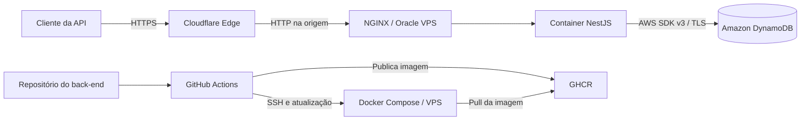
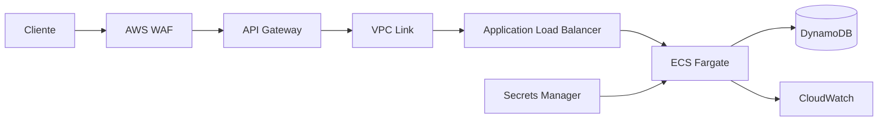

# Decisão de deploy do back-end

## Status

Aceita para o ambiente publicado do desafio.

## Contexto

A API precisa de um ciclo próprio de build, publicação e rollback. O objetivo é disponibilizar uma demonstração técnica de baixo custo, aproveitando uma VPS Oracle existente e utilizando serviços e práticas da AWS exigidos pela vaga.

O ambiente não pretende oferecer a disponibilidade, elasticidade e recuperação de desastre de uma arquitetura corporativa.

## Decisões arquiteturais relacionadas

- [ADR-004: Rate limit por endpoint com janela fixa e IP](./adr/ADR-004-rate-limit.md)
- [ADR-005: Autenticação web direta por cookie HttpOnly](./adr/ADR-005-autenticacao-cookie-http-only.md)

## Decisão

| Componente | Destino | Forma de entrega |
|---|---|---|
| API NestJS | Oracle VPS | Imagem Docker executada por Docker Compose atrás do NGINX. |
| Banco de dados | Amazon DynamoDB | Serviço gerenciado real da AWS. |
| DNS e TLS de borda | Cloudflare | Proxy HTTPS do subdomínio da API para a VPS. |
| Registro da imagem | GHCR | Imagens imutáveis identificadas pelo SHA do commit. |
| CI/CD | GitHub Actions | Validação, publicação da imagem e atualização da VPS. |
| Infraestrutura AWS | Terraform | Tabelas e políticas definidas de forma reproduzível. |

DynamoDB Local será usado somente em desenvolvimento e testes.

## Arquitetura publicada



`apiproducts.devmoreno.com.br` será um registro `A` com proxy da Cloudflare habilitado e apontará para o IPv4 da VPS. A configuração demonstrativa aceita TLS na borda e HTTP entre Cloudflare e NGINX; esse risco é descrito em [Segurança operacional](#segurança-operacional).

O navegador carregado pelo front-end chamará `apiproducts.devmoreno.com.br` diretamente. A Vercel não encaminhará requisições para a API. O front-end de produção será `products.devmoreno.com.br`, e sua origem exata será autorizada pela configuração CORS.

## Organização na VPS

```text
/opt/stone-app/
|-- compose.yaml
|-- .env
`-- nginx/
```

O Compose de produção terá os serviços `backend` e `nginx`. Apenas o NGINX ficará exposto; a porta do NestJS permanecerá na rede interna dos containers.

O NGINX será responsável por reverse proxy, cabeçalhos de segurança, limites de corpo, timeouts e logs sem credenciais ou tokens. O NestJS continuará responsável pela autenticação. A política de limitação de requisições está centralizada na [ADR-004](./adr/ADR-004-rate-limit.md).

O `Dockerfile` usará múltiplos estágios. A imagem final conterá somente a aplicação compilada, dependências de produção e um usuário sem privilégios administrativos.

## Pipeline

Após merge na branch principal, o GitHub Actions deverá:

1. Executar lint, verificação de tipos e testes.
2. Construir a imagem usando `Dockerfile` na raiz deste repositório.
3. Publicar a imagem no GHCR com o SHA completo do commit.
4. Acessar a VPS por SSH com credencial armazenada em GitHub Secrets.
5. Atualizar a referência da imagem e executar `docker compose pull`.
6. Recriar somente o serviço da API.
7. Validar o endpoint público `/health` por HTTPS.

A tag `latest` pode existir por conveniência, mas não será a referência exclusiva de deploy ou rollback.

## Rollback

O rollback reapontará o Compose para o SHA da imagem anterior, recriará o serviço e validará `/health`. Uma única instância pode causar alguns segundos de indisponibilidade. Deploy sem interrupção exigiria múltiplas instâncias e troca gradual, fora do escopo.

## DynamoDB e IAM

A VPS acessará o endpoint regional do DynamoDB exclusivamente por TLS. Como não pode receber uma IAM Role de EC2, será usado um principal IAM exclusivo da aplicação, com credenciais mantidas somente no ambiente protegido da VPS.

A política de execução ficará restrita às tabelas `users` e `products` e permitirá somente:

- `DescribeTable` para verificar a disponibilidade das tabelas;
- `GetItem` para login e consulta por identificador;
- `Scan` para a listagem inicial de produtos;
- `PutItem` para cadastro e criação de produtos;
- `UpdateItem` e `DeleteItem` para manutenção de produtos.

`Query` somente será adicionada se um padrão de acesso que a utilize for implementado. A unicidade continuará sendo garantida pelas `ConditionExpression` enviadas pela aplicação, não pela política IAM. Operações administrativas, criação de tabelas e carga inicial usarão uma identidade separada.

Em uma solução corporativa, credenciais de longa duração devem ser substituídas por credenciais temporárias ou pela execução da API dentro da AWS.

## Controle de custos

- Capacidade, armazenamento e recursos opcionais serão dimensionados para a demonstração.
- Auto Scaling, Global Tables, DAX, PITR, backups sob demanda e Streams ficarão desabilitados inicialmente enquanto não houver requisito para esses recursos.
- AWS Budgets e alertas de cobrança serão configurados.
- Preços e condições de gratuidade serão revisados no site oficial imediatamente antes do deploy.
- O tráfego de saída da AWS para a VPS será monitorado.

A gratuidade não constitui bloqueio rígido de gastos.

Referências:

- [Preços do Amazon DynamoDB](https://aws.amazon.com/dynamodb/pricing/on-demand/)
- [Ofertas gratuitas de bancos de dados AWS](https://aws.amazon.com/free/database/)
- [DynamoDB Local](https://docs.aws.amazon.com/amazondynamodb/latest/developerguide/DynamoDBLocal.html)

## Segurança operacional

- Clientes acessarão a API por HTTPS na borda da Cloudflare.
- O cookie JWT terá `HttpOnly`, `Secure`, `SameSite=Strict`, `Path=/` e não definirá `Domain`.
- CORS permitirá credenciais apenas para origens exatas configuradas; curingas não serão aceitos.
- Operações mutáveis seguirão `SameSite=Strict` e a validação de `Origin`/`Referer` definida na [ADR-006](./adr/ADR-006-protecao-csrf-origem.md).
- A comunicação VPS–DynamoDB usará TLS.
- Segredos ficarão em GitHub Secrets e no arquivo protegido da VPS.
- O `.env` terá permissão restrita e não será versionado.
- SSH usará chave dedicada; login por senha e acesso remoto de `root` serão desabilitados.
- O firewall restringirá HTTP na origem aos endereços publicados pela Cloudflare quando viável e limitará SSH a origens administrativas.
- O container executará sem privilégios e com política de reinício.
- Logs não registrarão senhas, JWTs ou credenciais AWS.

O trecho Cloudflare–VPS permanece sem criptografia na configuração demonstrativa. Credenciais e tokens podem ser observados se esse tráfego for interceptado. Essa decisão é aceita somente para o desafio e não deve ser apresentada ou reutilizada como prática adequada de produção. A evolução recomendada é instalar certificado válido na origem e usar TLS ponta a ponta.

## Observabilidade

- `/health` será o endpoint de readiness usado por pipeline, rollback e monitor externo. Retornará `200` somente quando a aplicação estiver inicializada e as tabelas necessárias do DynamoDB estiverem acessíveis; caso contrário, retornará `503` sem detalhes internos.
- Liveness será representada pelo estado do processo/container nesta versão; não haverá endpoint HTTP separado.
- Logs estruturados serão enviados à saída padrão do container.
- A rotação de logs impedirá crescimento ilimitado em disco.
- O pipeline verificará a saúde após cada deploy.
- Métricas do DynamoDB serão acompanhadas, especialmente `ConsumedReadCapacityUnits`, `ConsumedWriteCapacityUnits`, `ReadThrottleEvents` e `WriteThrottleEvents`.
- Um monitor externo poderá verificar periodicamente o endpoint `/health`.

## Limitações aceitas

- A VPS é ponto único de falha.
- Não há auto scaling nem implantação multi-região.
- O trecho de origem Cloudflare–VPS usa HTTP.
- A VPS acessa DynamoDB pela internet pública com TLS.
- Credenciais AWS de longa duração exigem armazenamento e rotação cuidadosos.
- O deploy em instância única pode causar breve indisponibilidade.

## Evolução para AWS



Essa evolução permitiria múltiplas instâncias, credenciais por IAM Roles for Tasks, segredos em tempo de execução, observabilidade centralizada e Auto Scaling.

## Consequências

### Positivas

- Reaproveitamento da VPS sem custo adicional de computação.
- Uso real de DynamoDB, IAM e infraestrutura reproduzível.
- Imagens imutáveis permitem rastreabilidade e rollback.
- O container pode migrar para ECS Fargate sem alteração funcional relevante.

### Negativas

- Operação e segurança da VPS ficam sob responsabilidade do projeto.
- A arquitetura híbrida adiciona latência entre Oracle Cloud e AWS.
- Não há alta disponibilidade.
- O trecho HTTP de origem não oferece confidencialidade em trânsito.
- Credenciais AWS fora da AWS exigem controles adicionais.
