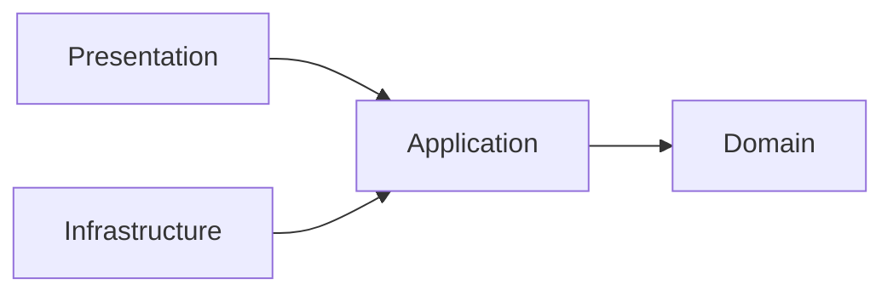

# ADR-001: Clean Architecture no back-end

## Status

Aceita

## Data da decisão

2026-09-02

## Documentos relacionados

- [Requisitos do back-end](../Requisitos.md)
- [Decisões de tecnologia](../Decisao-tecnologias.md)

## Contexto

O back-end contém autenticação e gestão do catálogo. As regras de negócio não devem depender diretamente do NestJS, DynamoDB, mecanismo de JWT ou transporte HTTP. Essa separação facilita testes, troca de adaptadores e evolução dos domínios.

## Decisão

O projeto adotará Clean Architecture, organizado primeiro por domínio de negócio e depois por camada. As operações serão representadas por casos de uso explícitos.

```text
src/
|-- modules/
|   |-- auth/
|   |   |-- domain/
|   |   |-- application/
|   |   |   |-- ports/
|   |   |   `-- use-cases/
|   |   |-- infrastructure/
|   |   |-- presentation/
|   |   `-- auth.module.ts
|   `-- products/
|       |-- domain/
|       |-- application/
|       |-- infrastructure/
|       |-- presentation/
|       `-- products.module.ts
|-- shared/
|-- app.module.ts
`-- main.ts

test/
Dockerfile
package.json
```

Os subdiretórios serão criados quando houver arquivos para ocupá-los.

## Camadas

### Domain

Contém entidades, value objects, invariantes, erros e serviços de domínio. Não importa NestJS, AWS SDK, DTOs HTTP ou mecanismos de persistência.

### Application

Orquestra o domínio por casos de uso como `AuthenticateUser`, `RegisterUser`, `CreateProduct`, `ListProducts`, `GetProduct`, `UpdateProduct` e `DeleteProduct`.

Também define portas para repositórios, hash e emissão de tokens. Casos de uso dependem das abstrações, nunca das implementações.

### Infrastructure

Implementa as portas com `DynamoDBDocumentClient`, Argon2id, JWT e outros adaptadores técnicos.

### Presentation

Contém controllers, DTOs, guards, decorators, mapeamento de erros e serialização OpenAPI. Controllers validam e convertem a entrada, invocam um caso de uso e transformam a saída; não implementam regras de negócio.

## Regra de dependência



- `domain` não depende de camadas externas.
- `application` depende de `domain` e de suas portas.
- `infrastructure` implementa portas de `application`.
- `presentation` chama casos de uso de `application`.
- Arquivos `*.module.ts` são o composition root do NestJS.

## Organização por domínio

Cada domínio mantém seus próprios modelos e casos de uso. Um módulo não acessa diretamente o repositório concreto de outro. Integrações ocorrem por casos de uso ou portas explícitas.

`shared` conterá somente elementos realmente transversais, não código sem domínio definido.

## Persistência

Entidades de domínio não recebem formatos do DynamoDB. Cada repositório mapeia entre o modelo persistido e o domínio. `LastEvaluatedKey` não escapa da infraestrutura; o contrato da aplicação usa cursor opaco.

## Testes

- Entidades, value objects e casos de uso têm testes unitários sem NestJS ou DynamoDB.
- Portas são substituídas por fakes ou mocks.
- Repositórios têm testes de integração com DynamoDB Local.
- Controllers, guards e módulos são cobertos por E2E.
- Testes unitários usam `*.spec.ts`; E2E ficam em `test`.

## Consequências

### Positivas

- Regras de negócio podem ser testadas sem framework ou banco.
- DynamoDB, JWT e HTTP permanecem detalhes substituíveis.
- Domínios e operações ficam explícitos e com baixo acoplamento.

### Negativas

- Há mais interfaces, mapeadores e arquivos do que em uma estrutura NestJS simples.
- Funcionalidades pequenas atravessam várias camadas.
- As regras de dependência exigem disciplina.

## Alternativas consideradas

Um repositório genérico para todas as entidades foi rejeitado por esconder padrões de acesso específicos do DynamoDB e criar uma abstração comum sem comportamento comum real.
