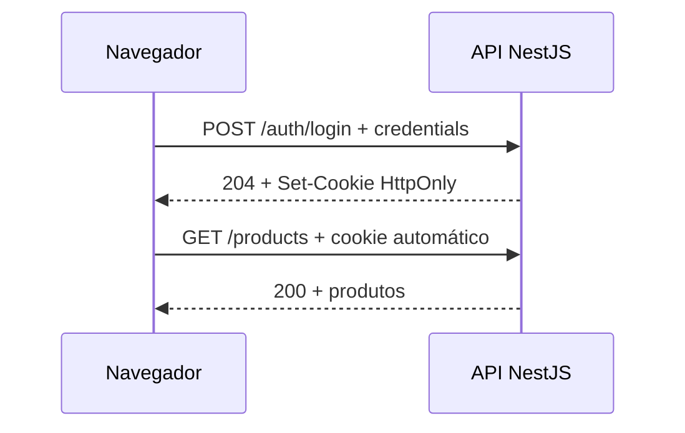

# ADR-005: Autenticação web direta por cookie HttpOnly

## Status

Aceita — parcialmente substituída pela [ADR-006](./ADR-006-protecao-csrf-origem.md) somente na estratégia de proteção CSRF e origem

## Data da decisão

2026-09-03

## Documentos relacionados

- [Requisitos do back-end](../Requisitos.md)
- [Contrato da API](../Contrato-da-API.md)
- [Decisões de tecnologia](../Decisao-tecnologias.md)
- [Decisão de deploy](../Decisao-deploy.md)
- [ADR-004: Rate limit por endpoint](./ADR-004-rate-limit.md)
- [ADR-006: Proteção CSRF por cookie e origem](./ADR-006-protecao-csrf-origem.md)

A ADR-006 substitui somente as decisões desta ADR sobre CSRF, `SameSite` e
validação de origem. A autenticação direta, o JWT, o cookie HttpOnly host-only,
o consumo por cookie e o logout sem sessão persistida continuam válidos.

## Contexto

O objetivo do desafio é entregar uma API independente. Acrescentar uma camada específica para cada interface duplicaria endpoints e introduziria complexidade fora do escopo principal.

O navegador precisa autenticar-se sem persistir o JWT em `localStorage` ou expô-lo ao JavaScript. A API já é a autoridade de credenciais, emissão de token, autorização e expiração; portanto, ela também pode controlar o transporte do JWT por cookie sem criar uma sessão stateful.

A entrega inicial executará uma única instância da API. A autenticação deve permanecer apta a múltiplas instâncias, mas o rate limit distribuído continuará fora do escopo conforme a ADR-004.

## Decisão

O navegador consumirá a API NestJS diretamente, sem endpoint intermediário. Após validar as credenciais, `POST /auth/login` emitirá um JWT válido por 900 segundos e o gravará em um cookie host-only chamado `__Host-stone_access_token`.

O JWT não será retornado no corpo da resposta nem ficará disponível ao JavaScript. Os guards da API extrairão o token do cookie e continuarão responsáveis por validar assinatura, emissor, audiência e expiração.

## Cookie de autenticação

No ambiente publicado, o cookie terá:

- nome com prefixo `__Host-`;
- `HttpOnly`, impedindo leitura por JavaScript;
- `Secure`, permitindo envio somente por HTTPS;
- `SameSite=Strict`;
- `Path=/`;
- ausência de `Domain`, mantendo-o restrito ao host da API;
- `Max-Age=900`, exatamente igual a `exp - iat` do JWT.

`JWT_ACCESS_TTL_SECONDS` terá valor `900` no ambiente publicado. Alterar essa duração exige revisão desta ADR; ambientes de teste poderão usar valor menor apenas para cenários automatizados com relógio controlado.

O ambiente local usará HTTPS ou um nome de cookie separado, sem o prefixo `__Host-`, quando precisar executar sobre HTTP. O cookie publicado nunca omitirá `Secure` nem reutilizará a configuração de desenvolvimento.

## Login e logout

`POST /auth/login` responderá `204 No Content` com `Set-Cookie` após autenticação válida. Credenciais inválidas retornarão `401 Unauthorized` com mensagem genérica e não criarão cookie.

`POST /auth/logout` será idempotente: responderá `204 No Content` e expirará o cookie com os mesmos atributos de escopo usados na criação mesmo quando o cookie estiver ausente, inválido ou expirado. Como não existe sessão persistida nem lista de revogação, o logout remove a credencial do navegador, mas não invalida antecipadamente uma cópia do JWT. Esse risco é limitado à duração máxima de 15 minutos do token.

## CORS e consumo pelo navegador

A API permitirá credenciais apenas para uma lista explícita de origens controladas. Não serão usados curingas de origem, métodos ou cabeçalhos em respostas CORS autenticadas.

A política permitirá explicitamente os métodos `GET`, `POST`, `PATCH`, `DELETE` e `OPTIONS`, o cabeçalho de requisição `Content-Type` e a leitura do cabeçalho de resposta `Retry-After`. Preflights `OPTIONS` não exigirão cookie nem serão contabilizados no rate limit dos endpoints de negócio. A validação detalhada de origem está na ADR-006.

O front-end usará `credentials: include` em todas as chamadas. Em produção, front-end e API usarão HTTPS e domínios pertencentes ao mesmo site registrável, por exemplo `app.example.com` e `api.example.com`, para que `SameSite=Strict` seja compatível com o fluxo direto.

Previews em domínio de terceiro não terão autenticação integrada contra a API de produção. Testes integrados usarão origens explicitamente cadastradas e controladas.

## Proteção contra CSRF

A estratégia de proteção CSRF desta ADR foi substituída pela [ADR-006](./ADR-006-protecao-csrf-origem.md). O cookie mantém `HttpOnly`, `Secure`, prefixo `__Host-`, `Path=/`, ausência de `Domain`, `Max-Age=900` e agora usa `SameSite=Strict`; a ADR-006 define a validação de `Origin`, o fallback de `Referer` e a compatibilidade com chamadas sem headers de contexto de navegador.

## Múltiplas instâncias

O cookie pertence ao navegador, não à instância que processou o login. Como o JWT é stateless, outra instância poderá validá-lo desde que todas compartilhem as mesmas chaves e regras de validação. Não será necessária afinidade de sessão no balanceador.

Chaves de assinatura, configuração de emissor, audiência e expiração deverão ser idênticas entre as instâncias. Revogação antecipada, refresh tokens e rotação com múltiplas chaves exigirão decisão posterior.

O rate limit em memória não compartilha essa propriedade e permanece restrito à instância única definida na ADR-004. Escalar horizontalmente exigirá um armazenamento distribuído para os contadores antes do segundo processo entrar em serviço.

## OpenAPI e clientes não web

A documentação OpenAPI declarará autenticação por cookie. Swagger UI no domínio da API poderá autenticar-se pelo mesmo endpoint de login.

Clientes de linha de comando poderão usar um cookie jar e omitir `Origin` e `Referer`; a chamada seguirá para autenticação. Não haverá contrato Bearer alternativo nesta versão, evitando dois mecanismos simultâneos de autenticação. Integrações máquina-a-máquina próprias continuam adiadas para uma decisão de API key, mTLS ou client credentials.

## Testes

- Login válido retorna `204` e cria o cookie com os atributos definidos.
- `exp - iat` e `Max-Age` são exatamente 900 segundos no ambiente publicado.
- Login inválido não cria cookie e retorna mensagem genérica.
- O JWT não aparece no corpo, em URLs ou logs.
- Rotas protegidas aceitam cookie válido e recusam cookie ausente, inválido ou expirado.
- Logout expira o cookie e retorna `204` mesmo sem sessão válida.
- CORS aceita somente origens exatas configuradas e permite credenciais.
- Operações mutáveis recusam origens inválidas e não autorizadas, e aceitam chamadas sem `Origin` e `Referer` para compatibilidade.
- Preflight `OPTIONS` de origem autorizada funciona sem cookie, anuncia métodos e cabeçalhos permitidos e não altera o bucket da operação real.
- Preflight de origem não autorizada é recusado sem executar autenticação ou caso de uso.
- O fluxo funciona sem qualquer endpoint ou cabeçalho específico de uma camada intermediária.

## Consequências

### Positivas

- A API permanece o único componente responsável pela autenticação.
- O front-end não implementa endpoints intermediários nem manipula JWT.
- O cookie reduz a exposição do token a JavaScript e persiste entre recarregamentos.
- A validação JWT continua stateless e não exige sticky session.
- O navegador chega diretamente à API, preservando o IP de origem para rate limit na borda confiável.

### Negativas

- A API assume responsabilidades de cookie, CORS e CSRF específicas de clientes web.
- Front-end e API precisam de configuração coordenada de domínios e origens.
- Previews hospedados em outro site não reutilizam o cookie `SameSite=Strict` de produção.
- Logout não revoga uma cópia do JWT antes de sua expiração.

## Alternativas consideradas

### JWT em localStorage

Simplificaria chamadas diretas com `Authorization: Bearer`, mas deixaria o token acessível a qualquer JavaScript executado na origem. Foi rejeitado pelo impacto de XSS.

### Sessão opaca persistida no servidor

Permitiria revogação centralizada, mas exigiria armazenamento compartilhado e mudaria o modelo stateless já escolhido. Foi adiada por complexidade desnecessária para o escopo inicial.

### Autenticação simultânea por cookie e Bearer

Atenderia navegadores e clientes genéricos com mecanismos diferentes, mas duplicaria contratos, testes e superfícies de segurança. Foi rejeitada nesta versão para manter um único fluxo.

## Critérios para revisão desta decisão

Esta ADR deverá ser revista se houver necessidade de aplicativo móvel, integração máquina a máquina, refresh token, logout com revogação imediata, front-end hospedado permanentemente em outro site ou múltiplas instâncias com rotação coordenada de chaves.

## Referências

- [RFC 7519 — JSON Web Token](https://datatracker.ietf.org/doc/html/rfc7519)
- [OWASP — Cross-Site Request Forgery Prevention Cheat Sheet](https://cheatsheetseries.owasp.org/cheatsheets/Cross-Site_Request_Forgery_Prevention_Cheat_Sheet.html)
- [MDN — Secure cookie configuration](https://developer.mozilla.org/en-US/docs/Web/Security/Practical_implementation_guides/Cookies)
- [MDN — Cross-Origin Resource Sharing](https://developer.mozilla.org/en-US/docs/Web/HTTP/Guides/CORS)
